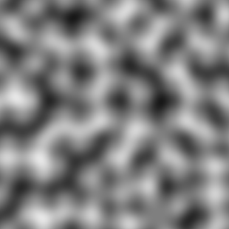

# VSFMPPNTFBUBG
Very simple free multi-platform Perlin noise 24 bit uncompressed bitmap generator.

---

## Version
Current version: **2020.08.1**

*The version format is &quot;&lt;year&gt;.&lt;zero padded month&gt;.&lt;revision number&gt;&quot;.*

---

## License

[MIT License](LICENSE.md)

---

## Perlin noise
Algorithm created by Ken Perlin that generates a type of noise that seems natural/organic, which can be used in places where simple independent random number generation values are not enough.

Here's an example generated with VSFMPPNTFBUBG (256 pixels by 256 pixels, and 32 cell size):


## BMP format

Format created by Microsoft Corporation, used to store bitmaps.

---

## Specifications

Description | Value
---|---
Perlin noise directions | (1, 1), (-1, -1), (-1, 1), (1, -1)
Cell size | 32 (configurable)
Bits per pixel | 24
Information header | BITMAPINFOHEADER
Compression method | None

## Usage

```
./vsfmppntfbubg <width> <height> [cell size]
```

---

## Notes

This generator was created for educational purposes only.